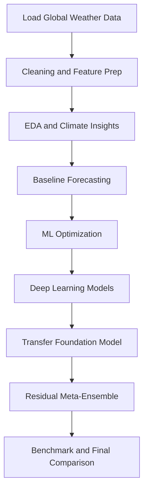

# PM Accelerator Data Science Assessment

Global weather analysis and forecasting using classical time-series models, machine learning, deep learning, transfer learning, and a final residual meta-ensemble.

## PM Accelerator Mission Statement

To accelerate the transition into product management and empower the next generation of tech leaders through hands-on, practical experience.

## Project Goal

Build an end-to-end forecasting workflow on global weather data that:

1. Explains climate patterns with strong exploratory analysis.
2. Benchmarks multiple forecasting families under the same evaluation setup.
3. Produces a final model that improves over a strong baseline.
4. Is reproducible and easy for reviewers to run.

## Repository Structure

```text
.
|- PM_accelerator_data_science_assessment (2).ipynb
|- README.md
|- requirements.txt
`- content/
	`- Tech Assessment For Data Scientists_Analyst.docx.md
```

## Visual Workflow



## Methodology (Experimentation Best Practices)

1. Time-aware evaluation
	- Forecasting uses chronological train/test split with the last 30 days as holdout.
	- Metrics are compared on aligned date indexes to avoid false gains.

2. Leakage control
	- Lag and rolling features use shifted targets only.
	- Residual meta-ensemble selection is based on out-of-fold behavior, not direct test tuning.

3. Reproducibility
	- Full dependency list is committed in requirements.txt.
	- The notebook is organized by numbered sections from data loading through final benchmark.

4. Comparative experimentation
	- Classical models: Holt-Winters, ARIMA.
	- ML models: Random Forest, optimized XGBoost, stacking.
	- DL models: CNN-LSTM, GRU, Temporal Transformer Encoder.
	- Transfer model: PatchTST/TTM workflow.
	- Final model: Residual Meta-Ensemble (champion).

## Assessment Coverage Map

| Requirement Area | Covered In Notebook |
|---|---|
| Data loading and preprocessing | Sections 1-2 |
| Exploratory data analysis | Section 3 |
| Baseline forecasting | Section 4 |
| Anomaly detection | Section 5 |
| Spatial weather analysis | Section 6 |
| Environmental impact analysis | Section 7 |
| Ensemble forecasting | Section 8 |
| Feature importance | Section 9 |
| Reproducibility artifacts | Sections 10-11 + repository files |
| Advanced experimentation | Sections 12-19 |

## Performance Snapshot

Latest notebook run shows the final model outperforming the optimized XGBoost baseline.

| Model | MAE |
|---|---:|
| Residual Meta-Ensemble | 0.2121 |
| XGBoost (Optimized) | 0.2352 |

Improvement over XGBoost baseline:

0.0231 MAE absolute reduction

## Quick Visual Leaderboard (Lower Is Better)

```text
Residual Meta-Ensemble  | 0.2121 | ##########
XGBoost (Optimized)     | 0.2352 | ###########
```

## How To Run

1. Create and activate a virtual environment.
2. Install dependencies.
3. Launch Jupyter and run the notebook top-to-bottom.

```bash
python -m venv .venv
source .venv/bin/activate
pip install -r requirements.txt
jupyter notebook "PM_accelerator_data_science_assessment (2).ipynb"
```

## Key Outputs Reviewers Should Check

1. Correlation and distribution plots in EDA.
2. Spatial temperature distribution and country-level comparisons.
3. Environmental impact relationships between weather and air quality indicators.
4. Final benchmark table where Residual Meta-Ensemble ranks first by MAE.

## Notes

1. The notebook includes some /content paths from Colab-oriented execution; for local execution, keep the dataset path consistent with your environment.
2. If transfer learning packages are unavailable in the runtime, install all dependencies from requirements.txt before execution.
